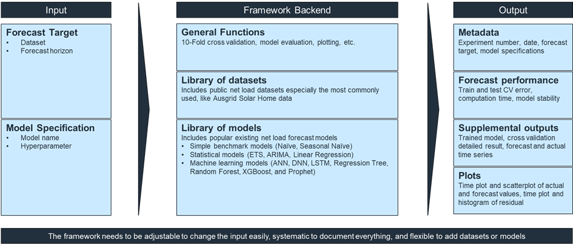

# Welcome to PyNNLF
PyNNLF (Python for Network Net Load Forecast) is a tool for evaluating net load forecasting model performance in a reliable and reproducible way.
It includes a library of public net load datasets and common forecasting models, including simple benchmark models. Users provide the forecast problem and model specifications, and the tool outputs evaluation results. It also allows users to add datasets, incorporate new models, and modify hyperparameters.

Researchers claiming a new or superior model can compare their results with existing ones on public datasets. The target audience includes researchers in academia or industry who are focused on evaluating and optimizing net load forecasting models.

A visual illustration of the tool's workflow is shown below. 

# Input
1. **Forecast Target**: Dataset and forecast horizon. A list of possible Forecast Target values is available in`notebooks/config/config.ipynb`.
2. **Model Specification**: Model and hyperparameters. A list of possible model specifications can be found in `notebooks/config/model_hyperparameters.ipynb`.

# Output
1. `a1_experiment_result.csv` – Contains accuracy (cross-validated test n-RMSE), stability (accuracy standard deviation), and training time.
2. `a2_hyperparameter.csv` – Lists the hyperparameters used for each model.
3. `a3_cross_validation_result.csv` – Detailed results for each cross-validation split.
4. `cv_plots/` – Folder with plots including:
   - Observation vs forecast (time plot)
   - Observation vs forecast (scatter plot)
   - Residual time plot
   - Residual histogram
5. `cv_test/` and `cv_train/` – Folders containing time series of observations, forecasts, and residuals for each cross-validation split.

# Tool Output Naming Convention
Format:
`[experiment_no]_[experiment_date]_[dataset]_[forecast_horizon]_[model]_[hyperparameter]`

Example:
`E00001_250915_ds0_fh30_m6_lr_hp1`

# Installation Instruction
1. Clone the whole repository to your personal computer.
2. Create a python virtual environment and install the requirements using pip install -r requirements.txt. This will take ~10 minutes. Although newer Python version should work, this tool was tested using Python 3.12.3. 

# How to Use The Tool
1. Open `notebooks/model/run_experiments.ipynb`.
2. Fill the input values (forecast problem & model specification) that you want. 
3. Run `notebooks/model/run_experiments.ipynb`.
4. Tool will output the evaluation result on `experiment_result/` as one folder. 
5. If you want to evaluate several forecast problems and model specifications at once, you can use `notebooks/model/run_experiments_batch.ipynb`

# Full Documentation
Detailed documentation including examples, testing, detailed guide, API reference, features & limitations, etc. can be seen here. [PyNNLF Documentation](https://mssamhan31.github.io/PyNNLF/)

# Acknowledgements
This project is part of Samhan's PhD study, supported by the University International Postgraduate Award (UIPA) Scholarship from UNSW, the Industry Collaboration Project Scholarship from Ausgrid, and the RACE for 2030 Industry PhD Scholarship. We also acknowledge Solcast and the Australian Bureau of Meteorology (BOM) for providing access to historical weather datasets for this research. We further acknowledge the use of Python libraries including Pandas, NumPy, PyTorch, Scikit-learn, XGBoost, Prophet, Statsmodels, and Matplotlib. Finally, we thank the reviewers and editor of the Journal of Open Source Software for their valuable feedback and guidance.

The authors declare that they have no competing financial, personal, or professional interests related to this work.

# Contributors
- **Samhan Samhan** (m.samhan@unsw.edu.au): Lead developer and researcher. Responsible for conceptualization, implementation, documentation, and experimentation.
- **Assoc Prof Anna Bruce**: Supervisor. Provided guidance on research direction and methodology.
- **Dr Baran Yildiz**: Supervisor. Provided guidance on research direction and methodology.
