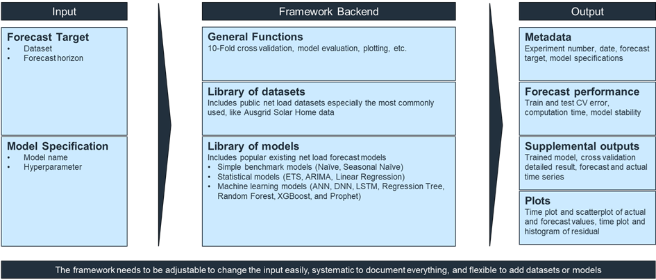

# Welcome to PyNNLF
PyNNLF (Python for Network Net Load Forecast) is a tool to evaluate net load forecasting model performance in a reliable and reproducible way.

This tool evaluates net load forecasting models aiming to make new net load forecasting research more reliable and reproducible. It includes a library of public net load datasets and common forecasting models, including simple benchmark models. Users input the forecast problem and model specification, and the tool outputs evaluation results. 

It also allows users to add datasets, models, and modify hyperparameters. Researchers claiming a new or superior model can compare their model with existing ones on public datasets. The target audience includes researchers working in academia or industry focusing on evaluating and optimizing net load forecasting models. 

It includes a library of public net load datasets and common forecasting models, including simple benchmark models. Users input the forecast problem and model specification, and the tool outputs evaluation results.

It also allows users to add datasets, models, and modify hyperparameters. Researchers claiming a new or superior model can compare their model with existing ones on public datasets. The target audience includes researchers in academia or industry focused on evaluating and optimizing net load forecasting models.

A visual illustration of the tool workflow is shown below.



# Input
1. **Forecast Target**: Dataset and forecast horizon defined in the YAML spec at example_project/specs/experiment.yaml.
2. **Model Specification**: Model and hyperparameters defined in the YAML spec at example_project/specs/experiment.yaml.

# Output
1. a1_experiment_result.csv – Contains accuracy (cross-validated test n-RMSE), stability (accuracy standard deviation), and training time.
2. a2_hyperparameter.csv – Lists the hyperparameters used for each model.
3. a3_cross_validation_result.csv – Detailed results for each cross-validation split.
4. cv_plots/ – Folder with plots including:
   - Observation vs forecast (time plot)
   - Observation vs forecast (scatter plot)
   - Residual time plot
   - Residual histogram
5. cv_test/ and cv_train/ – Folders containing time series of observations, forecasts, and residuals for each cross-validation split.

# Tool Output Naming Convention
Format:
[experiment_no]_[experiment_date]_[dataset]_[forecast_horizon]_[model]_[hyperparameter]

Example:
E00001_250915_ds0_fh30_m6_lr_hp1

# Installation Instruction
1. Install the package:
   On macOS, use `python3`/`pip3` if `python`/`pip` are not available.

   ```
   python -m pip install pynnlf
   ```

# How to Use The Tool
1. Initialize a workspace in any directory you want (example name: my_project). By default, only the sample dataset (ds0) is included. You can choose to download all datasets if needed:
   On macOS, use `python3 -c` if `python -c` is not available.

   ```
   python -c "import pynnlf; pynnlf.init('my_project')"
   ```

2. Set up your experiment in example_project/specs/experiment.yaml.
3. Run the experiment:
   ```
   python -c "import pynnlf; pynnlf.run_experiment('my_project/specs/experiment.yaml')"
   ```

4. View results under example_project/experiment_result.

# CI
CI (Continuous Integration) is automated testing that runs on code changes. CI is available to run smoke tests on 3 models and check whether results fall within the standard benchmark.

# Output
The tool will output the evaluation result in example_project/experiment_result as one folder.

# Full Documentation
Detailed documentation including examples, testing, detailed guide, API reference, features & limitations, etc. can be seen here. [PyNNLF Documentation](https://mssamhan31.github.io/PyNNLF/)

# Acknowledgements
This project is part of Samhan's PhD study, supported by the University International Postgraduate Award (UIPA) Scholarship from UNSW, the Industry Collaboration Project Scholarship from Ausgrid, and the RACE for 2030 Scholarship. We also acknowledge Solcast and the Australian Bureau of Meteorology (BOM) for providing access to historical weather datasets for this research. We further acknowledge the use of Python libraries including Pandas, NumPy, PyTorch, Scikit-learn, XGBoost, Prophet, Statsmodels, and Matplotlib. Finally, we thank the reviewers and editor of the Journal of Open Source Software for their valuable feedback and guidance.

The authors declare that they have no competing financial, personal, or professional interests related to this work.

# Contributors
- **M. Syahman Samhan** (m.samhan@unsw.edu.au): Lead developer and researcher. Responsible for conceptualization, implementation, documentation, and experimentation.
- **Anna Bruce**: Supervisor. Provided guidance on research direction and methodology.
- **Baran Yildiz**: Supervisor. Provided guidance on research direction and methodology.
