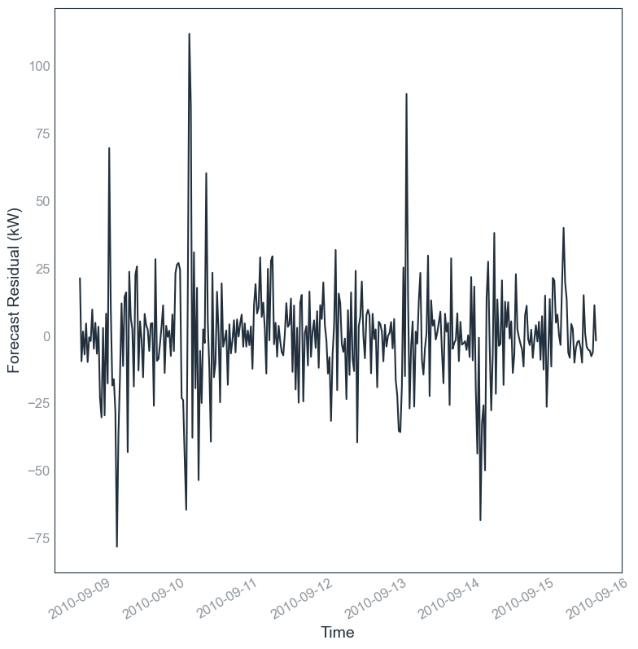

# Tool Name

# Introduction & Statement of Need
Net load is the difference between electricity load and solar generation. Forecasting net load is important to network operators both for operational and planning purpose. Since 2016, there has been more than 60 papers published on the topic. Most of them introduced new net load forecasting model and claimed superior performance. However, most of these results are obtained by a private evaluation. Many researchers used a publicly unavailable dataset, compared with another complex model as benchmark model, and did not share their implementaiton code publicly. Until now, there is no tool that can be readily used to evaluate net load forecasting models in a systematic way, compare it with other existing models, with a library of public net load dataset.

# Tool Objective & Target Audience
This tool aims to evaluate net load forecasting models in a reliable and reproducible manner. It has library of public net load datasets and common net load forecasting models including simple benchmark models. The user inputs the forecast problem and model specification, and the tool outputs the evaluation results. The tool enables the user to add their own dataset, model, and to modify the hyperparameters. Thus, a researcher claiming new and superior model can use this tool to compare their model with other existing models on a public dataset. The target audience of this tool is any researchers in academia or industry aiming to evaluate and optimise net load forecasting models. 

# Tool Input
1. Forecast problem: dataset & forecast horizon. List of possible forecast problem values is on notebooks/config/config.ipynb. 
2. Forecast model specification: model & hyperparameter. List of possible model specification is on notebooks/config/model_hyperparameters.ipynb.

# Tool output
1. a1_experiment result.csv : accuracy (cross-validated test n-RMSE Error), stability (accuracy stddev), training time,
2. a2_hyperparameter.csv : hyperparameter being used on the model
3. a3_cross_validation_result.csv : detailed result for each of the cross validation split
4. cv_plots folder: some plots of train and test set, consisting of
   1. observation vs forecast time plot
   2. observation vs forecast scatter plot
   3. residual time plot
   4. residual histogram
5. cv_test and cv_train folder: consisting of time series of the observation, forecast, and residual of each of the cross validation

# Tool output naming convention
[experiment no]_[experiment date]_[dataset]_[forecast horizon]_[model]_[hyperparameter]

# Installation Instruction
1. Clone the whole repository to your personal computer.
2. Create a python virtual environment and install the requirements using pip install -r requirements.txt. This will take ~10 minutes. Although newer Python version should work, this tool was tested using Python 3.12.3. 

# How to Use The Tool
1. Open notebooks/model/run_experiments.ipynb.
2. Fill the input values (forecast problem & model specification) that you want. 
3. Run notebooks/model/run_experiments.ipynb.
4. Tool will output the evaluation result on experiment_result/ as one folder. 
5. If you want to evaluate several forecast problems and model specifications at once, you can use notebooks/model/run_experiments_batch.ipynb

# Tool Testing & Example of How to Use The Tool
- For simple testing, follow the steps on "How to Use The Tool" above and try certain inputs. For example, use these inputs
dataset = ds0 # This is dataset for testing
forecast_horizon = fh1 # fh1 = 30 minutes ahead
model_name = m6 # this is linear regression
hyperparameter_no = 'hp1'
- For a complete test of all 18 models, use the file run_tests.ipynb and run all cells without modifying anything. It will output a file in experiment_result/Archive/Testing Result which compares all experiment outputs are within the acceptable range according to three benchmark outputs. This test takes around 1 hour using a personal computer with Intel i5 processor & 32GB RAM. 

# Result Example
- Suppose we do the simple test using the inputs above, this should take less than 1 minute.  
-   
- This is the output folder  
-   
- The file a1_experiment_result.csv will summarise the result, including the cross validated nRMSE & its standard deviation  
-   
- The file a3_cross_validation_result.csv will provide the cross validation (CV) detailed result, from CV1 to CV10  
-   
- Below are some plots on the test set  
     
   

# Tool Features
1. Adjustable. User can specify the dataset, forecast horizon, model, and model hyperparameter
2. Systematic. Every experiment performed also outputs metadata like experiment date, experiment number, forecast problem, model specification, etc.
3. Flexible. User can add or modify various aspects: model, dataset, hyperparameter, general functions, etc.

# Tool Limitation
1. Basic user interface. User needs to modify the code manually to change the model
2. Limited dataset and model. There are still many public net load datasets & models that can be added to the library.

# Folder Structure (WIP HERE)
- data: contains all dataset being used on this project
- experiment_result : storing experiment results and plots from running the model
- notebooks : all the codes being used

# Current Dataset and Model Library
The list of dataset available can be seen on the folder data, and the metadata can be seen on data/metadata.xlsx
The list of available model and its hyperparameter can be seen on config/model_hyperparameters.ipynb

# Configuration and Customization
## How to edit hyperparameter
Edit it on notebooks/0. config/config.ipynb

## How to add a dataset
- add on folder data
- edit config file
- for now, the minimum dataset length is 12 weeks. otherwise the tool will reutrn an error. 1 week for lookback period, 10 week for training & cross validation, 1 week for holdout test. 

## How to add a model

# License
MIT License

# Acknowledgements
This project is part of Samhan's PhD study, supported by the University International Postgraduate Award (UIPA) Scholarship from UNSW, the Industry Collaboration Project Scholarship from Ausgrid, and the RACE for 2030 Industry PhD Scholarship. We also acknowledge Solcast and the Australian Bureau of Meteorology (BOM) for providing access to historical weather datasets for this research. We further acknowledge the use of Python libraries including Pandas, NumPy, PyTorch, Scikit-learn, XGBoost, Prophet, Statsmodels, and Matplotlib. Finally, we thank the reviewers and editor of the Journal of Open Source Software for their valuable feedback and guidance.

# Potential Conflict Disclosure
The authors declare that they have no competing financial, personal, or professional interests related to this work.

# Raising Issue, Contributing, and Support Request
To report bugs, request features, or suggest improvements, please use the GitHub Issues feature. For contributing or seeking support, contact m.samhan@unsw.edu.au.