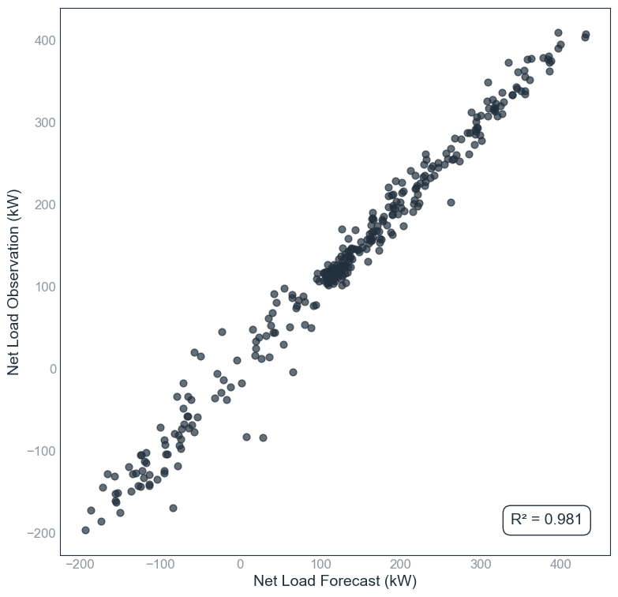
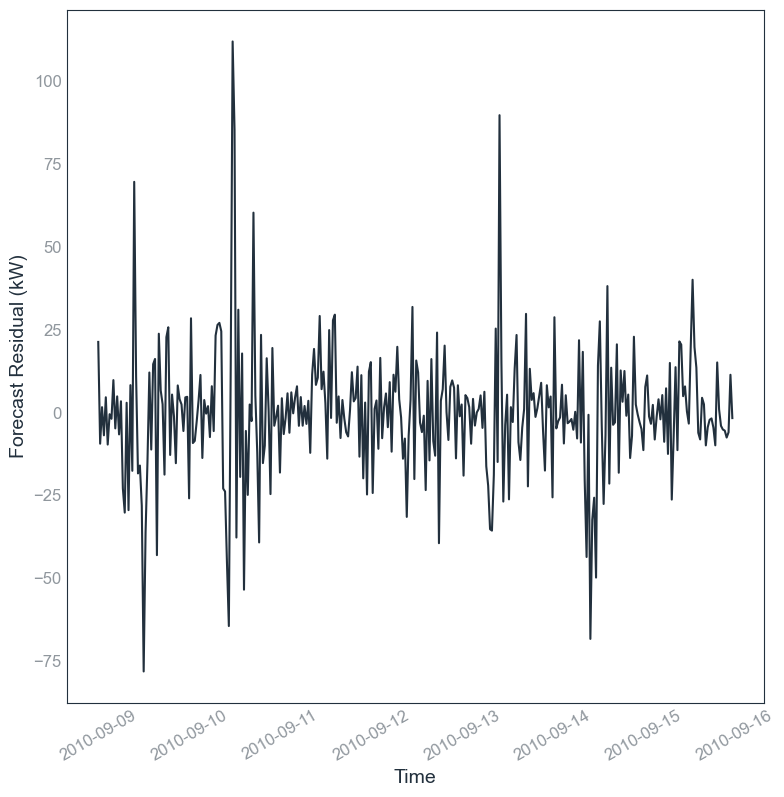
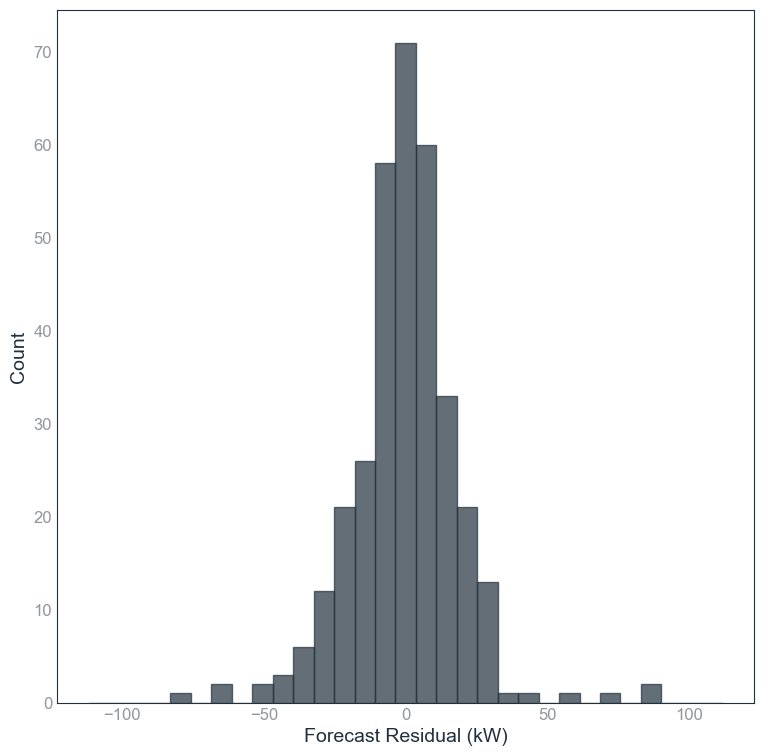

# User Input
Suppose we perform a simple test using the inputs below, which should take less than 1 minute in the `run_experiment.ipynb` file: 
```
# 1. RUN CONFIG
%run "../config/config.ipynb"

# 2. SETUP FORECAST PROBLEM AND MODEL SPECIFICATION (USER TO INPUT)
# FORECAST PROBLEM
dataset = ds0
forecast_horizon = fh1 # fh1 = 30 minutes ahead, fh9 = 2 days ahead
# MODEL SPECIFICATION
model_name = m6
hyperparameter_no = 'hp1'

# 3. RUN EXPERIMENT
run_experiment(dataset, forecast_horizon, model_name, hyperparameter_no)
```

# Output
The tool generates the following outputs.

| Name                        | Type    | Description                                                |
|-----------------------------|--------|------------------------------------------------------------|
| `E00001_cv_test/`           | Folder | Time series of observation, forecast, and residual for each cross-validation split |
| `E00001_cv_train/`          | Folder | Time series of observation, forecast, and residual for each cross-validation split |
| `E00001_cv1_plots/`         | Folder | Plots for the first cross-validation fold: time plot, scatter plot, residual plot, histogram |
| `E00001_models/`            | Folder | Saved models used or generated during the experiment      |
| `E00001_a1_experiment_result.csv` | File   | Accuracy (cross-validated test n-RMSE), stability, and training time |
| `E00001_a2_hyperparameter.csv`    | File   | Hyperparameters used for each model                        |
| `E00001_a3_cross_validation_result.csv` | File | Detailed results for each cross-validation split          |

The file `a1_experiment_result.csv` summarises the results, including the cross validated nRMSE & its standard deviation

| experiment_no | exp_date   | dataset_no | dataset | dataset_freq_min | dataset_length_week | forecast_horizon_min | train_pct | test_pct | model_no | hyperparameter_no | model_name   | hyperparameter       | runtime_ms  | train_RMSE | train_RMSE_stddev | test_RMSE | test_RMSE_stddev | train_nRMSE | train_nRMSE_stddev | test_nRMSE | test_nRMSE_stddev |
|---------------|-----------|------------|--------|----------------|-------------------|--------------------|-----------|----------|----------|-----------------|-------------|--------------------|------------|------------|-----------------|-----------|-----------------|------------|------------------|------------|------------------|
| E00001        | 15/09/2025 | ds0       | test   | 30             | 10                | 30                 | 0.9       | 0.1      | m6       | hp1             | m6_lr_hp1   | num_features: 50   | 201.769185 | 17.33      | 0.206421         | 17.7066   | 1.82726         | 2.98206    | 0.03552          | 3.04686    | 0.31443          |

The file `a3_cross_validation_result.csv` provides the detailed cross-validation (CV) results, from CV1 to CV10.
# Experiment Metrics

| #   | runtime_ms | train_MBE | train_MAE | train_RMSE | train_MAPE | train_MASE | train_fskill | train_R2 | test_MBE | test_MAE | test_RMSE | test_MAPE | test_MASE | test_fskill | test_R2 | train_nRMSE | test_nRMSE |
|-----|------------|-----------|-----------|------------|------------|------------|--------------|----------|----------|----------|-----------|-----------|-----------|-------------|---------|-------------|------------|
| 1   | 193.2564   | 0         | 12.208    | 17.122     | 27.366     | 0.422      | 55.471       | 0.988    | -0.1804  | 13.278   | 19.679    | 22.808    | 0.459     | 43.531      | 0.981   | 2.9463      | 3.3863     |
| 2   | 224.8719   | 0         | 12.337    | 17.495     | 27.347     | 0.423      | 54.817       | 0.988    | -0.1443  | 12.332   | 16.346    | 18.905    | 0.423     | 49.006      | 0.987   | 3.0105      | 2.8127     |
| 3   | 251.0867   | 0         | 12.361    | 17.477     | 22.314     | 0.433      | 54.031       | 0.987    | 0.3318   | 11.965   | 16.321    | 60.409    | 0.419     | 58.022      | 0.989   | 3.0074      | 2.8084     |
| 4   | 174.1974   | 0         | 12.401    | 17.573     | 28.635     | 0.434      | 53.775       | 0.987    | -0.8563  | 11.654   | 15.427    | 13.623    | 0.408     | 60.346      | 0.992   | 3.0239      | 2.6546     |
| 5   | 232.7249   | 0         | 12.281    | 17.020     | 22.091     | 0.435      | 54.565       | 0.988    | 1.2783   | 12.536   | 20.375    | 70.615    | 0.444     | 53.147      | 0.986   | 2.9287      | 3.5060     |
| 6   | 173.2767   | 0         | 12.322    | 17.467     | 28.530     | 0.436      | 53.491       | 0.987    | -0.6225  | 12.436   | 16.567    | 12.690    | 0.440     | 61.224      | 0.991   | 3.0056      | 2.8508     |
| 7   | 233.0346   | 0         | 12.171    | 17.004     | 26.500     | 0.427      | 55.250       | 0.988    | 0.8754   | 13.685   | 20.516    | 27.756    | 0.480     | 47.485      | 0.981   | 2.9260      | 3.5303     |
| 8   | 212.3849   | 0         | 12.286    | 17.390     | 26.759     | 0.428      | 54.516       | 0.988    | -0.7814  | 12.809   | 17.191    | 23.091    | 0.447     | 53.467      | 0.985   | 2.9924      | 2.9581     |
| 9   | 157.8457   | 0         | 12.330    | 17.417     | 28.242     | 0.435      | 53.965       | 0.988    | -1.0170  | 12.308   | 16.923    | 10.919    | 0.434     | 58.189      | 0.989   | 2.9970      | 2.9120     |
| 10  | 165.0126   | 0         | 12.269    | 17.335     | 28.311     | 0.421      | 55.265       | 0.988    | 1.0148   | 12.840   | 17.721    | 11.193    | 0.441     | 44.110      | 0.979   | 2.9829      | 3.0493     |
| **mean**  | 201.7692   | 0         | 12.2966   | 17.330     | 26.6095    | 0.4294     | 54.5146      | 0.9877   | -0.0102  | 12.5843  | 17.7066   | 27.2009   | 0.4395    | 52.8527     | 0.986   | 2.9821      | 3.0469     |
| **stddev**| 33.2319    | 0         | 0.0693    | 0.2064     | 2.4352     | 0.00591    | 0.6866       | 0.00048  | 0.8405   | 0.5983   | 1.8273    | 21.106    | 0.02059   | 6.5729      | 0.00447 | 0.03552     | 0.31443    |


Below are some plots on the test set:

|  |  |
|:---:|:---:|
| **Figure 1:** Observation vs Forecast (Time Plot) | **Figure 2:** Observation vs Forecast (Scatter Plot) |

|  |  |
|:---:|:---:|
| **Figure 3:** Residuals Over Time | **Figure 4:** Residual Histogram |